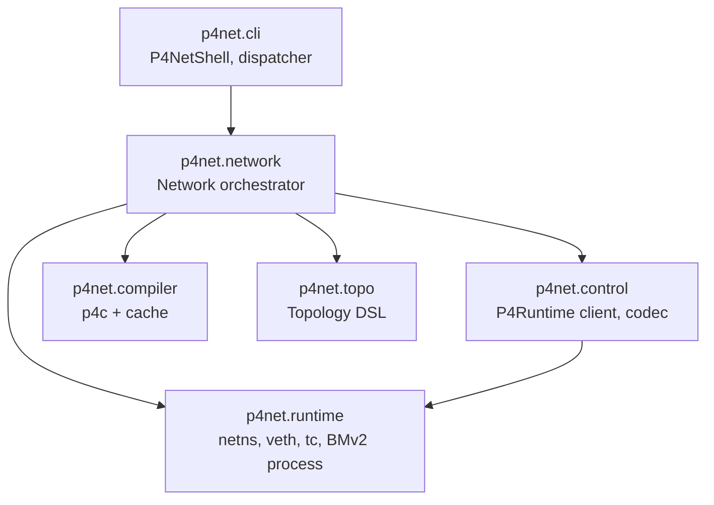

# Architecture

p4net is six Python packages on top of `p4c`, BMv2, and the Linux
kernel. This page explains what each package does, why it exists, and
how they compose at runtime.

## Layered architecture

Higher layers depend on lower layers. The `cli` and `control` layers
share a transitive dependency on `runtime` (the CLI to spawn host
commands; the control client because BMv2 lives in a `runtime`-managed
process), but they don't import each other.

## The six packages

### `p4net.runtime`

System primitives:

- **`NetworkNamespace`** — `ip netns add/del/exec` lifecycle. The
  `exec` and `popen` methods shell out to `ip netns exec <name> <argv>`
  rather than calling `setns()` from Python. (See *Design
  principles* below for why.)
- **`VethPair`** — creates a kernel veth pair, moves either end into a
  namespace, sets addresses (IPv4 and IPv6), MAC, MTU, and link state.
  Backed by `pyroute2` for the netlink calls.
- **`apply_netem` / `clear_qdisc`** — `tc qdisc add/del root netem
  rate=... delay=... loss ...` on a single interface inside a target
  namespace. Idempotent.
- **`BMv2Switch`** — `Popen`-wrapped `simple_switch_grpc` lifecycle.
  Builds the argv (port-to-iface map, gRPC bind address, optional
  Thrift, `--cpu-port`, log level), waits for the gRPC port to accept
  connections, exposes signal-based teardown.
- **`NSProcess`** — minimal wrapper around `subprocess.Popen` for
  processes that live in a namespace; supports `pid`, `poll`, `wait`,
  `terminate`, `kill`, plus a no-op `close()` preserved for API
  stability with earlier phases.
- **`disable_ipv6` / `enable_ipv6`** — per-interface sysctl helpers
  (`net.ipv6.conf.<iface>.{disable_ipv6,accept_ra,autoconf}`). Run via
  `ns.exec(["sysctl", "-w", ...])`.

The runtime layer carries no orchestration. Each primitive fails fast
with an explicit exception; the caller is responsible for ordering and
cleanup.

API: [`p4net.runtime`](api/runtime.md).

### `p4net.topo`

Descriptive DSL — pure data, no system calls:

- **`Host`** — name, IPv4 (`ip`, `default_route`), IPv6 (`ip6`,
  `default_route6`), MAC. Field validation in `__post_init__`.
- **`P4Switch`** — name, `p4_src`, architecture (`v1model`),
  `device_id`, `grpc_port`, `thrift_port`, `cpu_port`, `log_level`,
  `pcap_enabled`.
- **`LinkEndpoint`** — node name, port number, interface name, optional
  per-link `ip` / `ip6` / `mac` overrides.
- **`Link`** — symmetric `bandwidth` / `delay` / `jitter` / `loss_pct`,
  or per-direction `*_a_to_b` / `*_b_to_a` (asymmetric). Mixing
  symmetric and asymmetric on the same parameter is a validation
  error.
- **`Topology`** — builder. `add_host`, `add_switch`, `add_link`,
  `validate()`, `to_dict()` / `from_dict()`, `to_graphviz()` /
  `render_graphviz()`. Auto-allocates host port numbers (starting at
  0) and switch port numbers (starting at 1), interface names of the
  form `<node>-eth<port>` clamped to Linux's 15-character ifname limit.

`Topology.validate()` runs at `Network.start()` time (unless `unsafe=True`)
and at every `topology graph` invocation. It checks endpoint
references, port collisions, switch device-id / gRPC-port / Thrift-port
collisions, interface name lengths, IPv4 address collisions inside the
same `/N`, IPv6 address collisions inside the same `/N`, and link
parameter consistency (e.g. `jitter_a_to_b` requires `delay_a_to_b` or
the symmetric `delay`).

API: [`p4net.topo`](api/topo.md).

### `p4net.compiler`

Wraps `p4c -b bmv2 --p4runtime-files=p4info.txtpb`. Output is cached
under `~/.cache/p4net/compiler/` keyed by the SHA-256 of the source
bytes plus the literal compiler argument list. Cache hits are a no-op;
cache misses run `p4c` and stash both `bmv2_json` and `p4info.txtpb`
under the keyed directory. Re-running with a freshly modified source
or changed flags invalidates the entry for that hash.

API: [`p4net.compiler`](api/compiler.md).

### `p4net.control`

P4Runtime gRPC client and codec helpers:

- **`P4RuntimeClient`** — one gRPC channel per device. Performs the
  master-arbitration handshake on `connect()` (election ID is
  millisecond-since-epoch so re-running the same script always claims
  primary), pushes pipeline configs, runs the table CRUD primitives,
  reads counters, manages multicast groups, drives the StreamChannel
  for CPU-port packet I/O.
- **`P4InfoIndex`** — name → ID lookups, match-field bitwidth and
  match-type resolution, `encode_match`, `decode_match` (renders raw
  P4Runtime canonical bytes back into IPv4/IPv6/MAC/decimal human
  strings), `encode_action`, controller-header schemas
  (`packet_in_metadata_schema`, `packet_out_metadata_schema`).
- **codec helpers** — `encode_int`, `encode_ipv4`, `encode_mac`,
  `encode_value` (auto-dispatch), `decode_int`, `decode_ipv4`,
  `decode_ipv6`, `decode_mac`, `parse_lpm`, `parse_ternary`,
  `parse_range`, `format_exact`, `format_lpm`, `format_ternary`,
  `format_range`, `canonicalize`. Width-aware formatting selects IPv4
  for 32-bit fields, MAC for 48-bit, IPv6 for 128-bit, decimal for
  everything else.

API: [`p4net.control`](api/control.md).

### `p4net.network`

The orchestrator. `Network(topology)` composes every layer:

1. Validate the topology (unless `unsafe=True`).
2. Allocate `log_dir` (explicit or fresh tempdir) and `pcap_dir`.
3. Compile each switch's P4 source via `P4Compiler.compile()`.
4. Install atexit and SIGINT/SIGTERM handlers on the main thread; add
   self to the cleanup registry.
5. Create one Linux namespace per host; bring `lo` up.
6. For each link: create the veth pair, move the host-side end into
   its namespace, set the IPv6 sysctl gate (enable if `ip6` is set,
   disable otherwise), configure addresses / MAC / MTU, bring the
   interface up. Apply `tc netem` per direction.
7. Add IPv4 and IPv6 default routes per host as configured.
8. Launch one `simple_switch_grpc` process per switch, wait for the
   gRPC port to become reachable.
9. Open one `P4RuntimeClient` per switch, push the pipeline config.
10. Build the `RunningHost` / `RunningSwitch` proxies the user
    consumes via `net.host(name)` / `net.switch(name)`.

`stop()` (called from `__exit__`, atexit, signal, or explicitly)
unwinds everything in reverse: spawned xterms, P4Runtime clients,
BMv2 processes, veth pairs, namespaces, then unregisters from the
cleanup registry. Each step is wrapped in a logged `try/except` so
one failure can't leak the rest.

`Network` also owns the high-level helpers: `ping`, `pingall`,
`pingall6`, `xterm`. They route through `RunningHost.ping` and
`RunningHost.popen`.

API: [`p4net.network`](api/network.md).

### `p4net.cli`

Interactive shell:

- **`CommandDispatcher`** — pure parser/executor. Takes a `Network`,
  accepts a single input line, returns formatted text. No interactive
  concerns; unit-tested directly.
- **`P4NetShell`** — `prompt_toolkit` REPL: `FileHistory` at
  `~/.p4net_history`, `NestedCompleter` over commands / host names /
  switch names / sub-verbs, Ctrl-C cancels the current input, Ctrl-D
  exits cleanly.
- **`build_network_completer`** — dynamically reads the dispatcher's
  `_top_level_handlers`, `_host_handlers`, `_switch_handlers` keys so
  new commands light up at the prompt without editing the completer.
- **`p4net.cli.main`** — `argparse`-driven console script. Loads a
  topology file by path via `importlib.util.spec_from_file_location`,
  brings the network up, calls `setup(net)` if defined, then either
  runs the shell (default) or blocks on `signal.pause()` (`--no-shell`).

API: [`p4net.cli`](api/cli.md).

## Design principles

### BMv2 in the root namespace, hosts in private namespaces

This is the Mininet pattern. Every host gets its own `ip netns`; the
BMv2 dataplane processes live in the root namespace. Justifications:

- **Simpler gRPC reachability.** The P4Runtime client connects to
  `127.0.0.1:<grpc_port>` from the root namespace without crossing a
  veth. Putting BMv2 in a namespace would force a control-plane veth
  per switch.
- **Lower listen-port juggling.** Every BMv2 process binds its gRPC
  and Thrift ports in the root namespace; collisions across switches
  are caught by `Topology.validate()` before any process starts.
- **The kernel already isolates packet flow.** The veth peers are in
  the host namespaces; the BMv2 process operates on the root-namespace
  end of each pair. There's no cross-flow risk that namespace
  isolation would prevent.

### `subprocess.Popen(["ip", "netns", "exec", ...])` over `pyroute2.NSPopen`

Phase 7 of development reproduced a deadlock: `pyroute2.NSPopen` does
`fork()` followed by `setns()` in the child, then calls back into
Python before `execve()`. When the parent process has already started
threads (e.g. the P4Runtime client's StreamChannel consumer), those
threads' state is forked into the child, where reaching the GIL or
allocating memory can deadlock. The fix was to invoke `ip netns exec
<name> <argv>` as a regular `subprocess.Popen` — the kernel's wrapper
does `clone()` with the right flags and `execve()`s without running
Python in between, so there's no fork-then-Python window.

Every namespace-side execution path in p4net (host commands, ping,
xterm, tcpdump in tests, sysctl gating) goes through this route.

### Content-addressed compiler cache

`P4Compiler` keys the cache on the SHA-256 of the source bytes plus
the literal `p4c` argument list. Touching the source without changing
its bytes is a cache hit; changing flags is a cache miss; running
multiple topologies that share a `.p4` source share the cache entry.
The cache lives at `~/.cache/p4net/compiler/<hash>/`.

If the cache ever appears stale (it shouldn't), `rm -rf
~/.cache/p4net/compiler/` is the supported reset.

### Cleanup is first-class

Four redundant unwind paths target the same `Network.stop()`:

1. **`__exit__`** when the user wraps `Network` in `with`.
2. **`atexit`** when the script exits normally without the context
   manager.
3. **SIGINT / SIGTERM** handlers on the main thread re-raise after
   tearing down.
4. **Explicit `net.stop()`** when neither of the above applies.

`stop()` is fully idempotent and tolerant of partial state — running
it twice is a no-op; running it after a failed `start()` cleans up
whatever did succeed before the exception. The teardown order is:

1. Spawned user processes (`xterm`, etc.).
2. P4Runtime clients (`disconnect`, `_teardown` on the StreamChannel).
3. BMv2 processes (`SIGTERM`, then `SIGKILL` after a 2-second wait).
4. veth pairs (`ip link del` from the root namespace).
5. Network namespaces (`ip netns del`).
6. Cleanup registry deregistration.

### IPv6 sysctl gating before interface up

The Linux kernel auto-generates a link-local `fe80::` address on every
interface that is brought up while `disable_ipv6=0`. For p4net's
purposes — a controlled lab where users explicitly opt into IPv6 — that
auto-generated address is noise: it prompts MLD chatter on the punt
path, populates `<host> ifconfig` with addresses the user didn't ask
for, and wastes time on neighbor solicitation.

The orchestrator sets the per-interface sysctl **before** running `ip
link set up`. If the host descriptor or the link endpoint has `ip6` set,
`enable_ipv6(ns, iface)` writes `disable_ipv6=0`, `accept_ra=0`,
`autoconf=0` (so SLAAC stays off and only the explicit address is
present). Otherwise `disable_ipv6=1` is written, and the kernel skips
the auto link-local generation entirely.

### Asymmetric impairment via direction-mapped veth-side `tc qdisc`

When you set `Link(a=h1, b=s1, delay_a_to_b="200ms")`, the
orchestrator applies `tc netem delay 200ms` to the `a`-side veth
interface — the one that lives in `h1`'s namespace. Egress from `h1`
toward `s1` flows through that interface, picks up the delay, and
arrives 200 ms later at the BMv2 ingress. The `b`-side (`s1-eth1` in
the root namespace) carries no qdisc, so the reverse direction
(`s1` → `h1`) is unshaped.

Verified empirically: a `delay_a_to_b="200ms"` (h1 → s1) plus
`delay_b_to_a="20ms"` (s1 → h2 — note that for `Link(h2, s1)`, b → a
is s1 → h2) produced a measured ping RTT of `220.981/221.288/222.048
ms (min/avg/max)` — exactly the 220 ms one-way pair, with sub-ms
jitter from kernel scheduling.

## Data flow walk-through

What happens when `h1.ping(h2)` runs in a port-swap topology:

1. `h1.ping(h2)` runs `ping -4 -c 1 -W 2 -w 3 10.0.0.2` inside `h1`'s
   namespace via `subprocess.run(["ip", "netns", "exec", "h1", ...])`.
2. The kernel's ping crafts an ICMP echo and hands it to `h1-eth0`.
3. The packet traverses the veth pair to `s1-eth1` in the root
   namespace.
4. BMv2's parser extracts the Ethernet header. The ingress control
   sees `std.ingress_port == 1`, sets `std.egress_spec = 2`, and the
   pipeline emits the packet on port 2 — `s1-eth2`.
5. The packet crosses the second veth pair into `h2`'s namespace,
   arriving on `h2-eth0`.
6. The kernel's IP stack resolves the ICMP, replies (the static ARP
   from `setup(net)` short-circuits the resolution), and the reply
   takes the reverse path: `h2-eth0 → s1-eth2 → BMv2 (port 2 → port
   1) → s1-eth1 → h1-eth0`.
7. `h1`'s ping process sees the reply, exits with rc=0, and
   `RunningHost.ping` returns `True`.

The same path applies to IPv6 ICMP, modulo the `-6` flag and the
`hdr.ipv6` extraction in the P4 program.

## What's deliberately not supported

These are intentional v0.x non-goals. See the [Roadmap](roadmap.md)
for items that may move into v0.3.0 or later.

- **Docker, Podman, any container runtime.** The whole point of
  netns-based hosts is to skip the container layer's overhead and
  failure modes.
- **OpenFlow, Open vSwitch.** p4net is P4-first; OpenFlow programmability
  doesn't compose with P4's match-action graph in a useful way.
- **PSA architecture, Tofino targets, hardware switches.** v0.x
  exercises only the BMv2 v1model architecture.
- **Live topology mutation.** `Topology` is frozen at `Network.start()`.
  Add/remove hosts and links during a run requires a full restart.
- **Distributed simulation across multiple hosts.** Federating two
  p4net instances across a network is out of scope; a v1.0
  conversation.
- **gNMI, gNOI, OpenConfig.** Only P4Runtime is implemented for the
  control plane.
