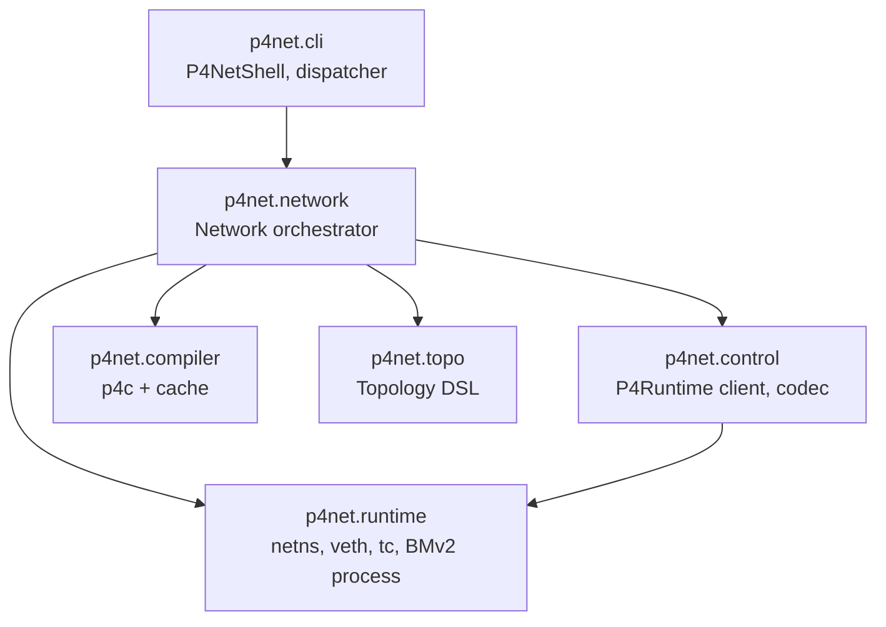

# 架构

p4net 是建立在 `p4c`、BMv2 与 Linux 内核之上的六个 Python 包。本页
说明每个包的职责、为何如此组织，以及它们在运行时如何协作。

## 分层架构

上层依赖下层。`cli` 与 `control` 共享对 `runtime` 的传递依赖
（CLI 用它在主机命名空间内执行命令；control 客户端依赖它，因为
BMv2 是 `runtime` 管理的进程），但二者之间没有直接依赖。

## 六个包

### `p4net.runtime`

系统原语：

- **`NetworkNamespace`** —— `ip netns add/del/exec` 的生命周期封装。
  `exec` 与 `popen` 通过 `ip netns exec <name> <argv>` 调用
  `subprocess`，而非在 Python 中调用 `setns()`。原因见下文「设计
  原则」。
- **`VethPair`** —— 创建一对内核 veth、把任一端搬入命名空间、设置
  地址（IPv4 与 IPv6）、MAC、MTU 与链路状态。底层通过 `pyroute2`
  发起 netlink 调用。
- **`apply_netem` / `clear_qdisc`** —— 在指定命名空间的某个接口上
  执行 `tc qdisc add/del root netem rate=... delay=... loss ...`。
  幂等。
- **`BMv2Switch`** —— 用 `Popen` 包装 `simple_switch_grpc` 的生命
  周期。构造 argv（端口到接口的映射、gRPC 绑定地址、可选 Thrift、
  `--cpu-port`、日志等级），等待 gRPC 端口可连，提供基于信号的
  停机方法。
- **`NSProcess`** —— 对 `subprocess.Popen` 的最小封装，用于命名空间
  内运行的进程；提供 `pid`、`poll`、`wait`、`terminate`、`kill`，
  以及为兼容旧调用而保留的空操作 `close()`。
- **`disable_ipv6` / `enable_ipv6`** —— 按接口的 sysctl 帮助函数
  （`net.ipv6.conf.<iface>.{disable_ipv6,accept_ra,autoconf}`），
  通过 `ns.exec(["sysctl", "-w", ...])` 写入。

runtime 层不承担任何编排职责。每个原语遇到失败立即抛出明确的异常；
顺序与清理由调用者负责。

API：[`p4net.runtime`](api/runtime.md)。

### `p4net.topo`

描述性 DSL——纯数据，不涉及任何系统调用：

- **`Host`** —— 名称、IPv4（`ip`、`default_route`）、IPv6
  （`ip6`、`default_route6`）、MAC。字段在 `__post_init__` 中校验。
- **`P4Switch`** —— 名称、`p4_src`、架构（`v1model`）、`device_id`、
  `grpc_port`、`thrift_port`、`cpu_port`、`log_level`、`pcap_enabled`。
- **`LinkEndpoint`** —— 节点名、端口号、接口名，以及链路级的 `ip` /
  `ip6` / `mac` 覆盖。
- **`Link`** —— 对称的 `bandwidth` / `delay` / `jitter` / `loss_pct`，
  或逐方向的 `*_a_to_b` / `*_b_to_a`（非对称）。同一参数同时设置
  对称与非对称值会被校验拒绝。
- **`Topology`** —— 构造器。`add_host`、`add_switch`、`add_link`、
  `validate()`、`to_dict()` / `from_dict()`、`to_graphviz()` /
  `render_graphviz()`。主机端口号自动从 0 起分配，交换机端口号
  从 1 起；接口名形如 `<node>-eth<port>`，长度被截断到 Linux
  规定的 15 字符上限。

`Topology.validate()` 会在 `Network.start()` 时（除非传 `unsafe=True`）
自动运行，也会在每次 `topology graph` 调用时运行。它检查端点引用、
端口冲突、交换机 device_id / gRPC 端口 / Thrift 端口冲突、接口名
长度、同一 `/N` 内的 IPv4 与 IPv6 地址冲突，以及链路参数一致性
（例如 `jitter_a_to_b` 必须搭配 `delay_a_to_b` 或对称的 `delay`）。

API：[`p4net.topo`](api/topo.md)。

### `p4net.compiler`

封装 `p4c -b bmv2 --p4runtime-files=p4info.txtpb`。输出缓存于
`~/.cache/p4net/compiler/`，键为源码字节的 SHA-256 加上字面参数
列表。命中缓存时不做任何事；未命中时调用 `p4c`，并把
`bmv2_json` 与 `p4info.txtpb` 一起放入对应键的目录。修改源码或参数
都会让该键失效。

API：[`p4net.compiler`](api/compiler.md)。

### `p4net.control`

P4Runtime gRPC 客户端与 codec 帮助函数：

- **`P4RuntimeClient`** —— 每个设备一个 gRPC 通道。在 `connect()`
  时执行主控权选举握手（选举 ID 取毫秒级时间戳，重跑同一脚本
  总是能稳定夺得主控者地位），推送流水线配置，提供表项 CRUD、
  计数器读取、组播组管理，以及通过 StreamChannel 进行的 CPU 端口
  数据包 I/O。
- **`P4InfoIndex`** —— 名称到 ID 的查询、匹配字段位宽与类型解析、
  `encode_match`、`decode_match`（把 P4Runtime 规范字节渲染为
  IPv4/IPv6/MAC/十进制人类可读字符串）、`encode_action`、控制器
  报头 schema（`packet_in_metadata_schema`、
  `packet_out_metadata_schema`）。
- **codec 帮助函数** —— `encode_int`、`encode_ipv4`、`encode_mac`、
  `encode_value`（自动分发）、`decode_int`、`decode_ipv4`、
  `decode_ipv6`、`decode_mac`、`parse_lpm`、`parse_ternary`、
  `parse_range`、`format_exact`、`format_lpm`、`format_ternary`、
  `format_range`、`canonicalize`。位宽感知的格式化器对 32 位字段
  渲染为 IPv4，48 位为 MAC，128 位为 IPv6，其余位宽为十进制。

API：[`p4net.control`](api/control.md)。

### `p4net.network`

编排器。`Network(topology)` 把所有层组合在一起：

1. 校验拓扑（除非 `unsafe=True`）。
2. 分配 `log_dir`（用户指定或新建临时目录）与 `pcap_dir`。
3. 通过 `P4Compiler.compile()` 编译每个交换机的 P4 源码。
4. 在主线程上注册 atexit 与 SIGINT/SIGTERM 处理器；把自己加入
   清理注册表。
5. 为每个主机创建一个 Linux 命名空间，把 `lo` 拉起。
6. 对每条链路：创建 veth 对，把主机侧搬入对应命名空间，设置 IPv6
   sysctl 门控（设置了 `ip6` 则启用，否则禁用），配置地址 / MAC /
   MTU，把接口拉起。逐方向应用 `tc netem`。
7. 按主机配置添加 IPv4 与 IPv6 默认路由。
8. 为每个交换机启动一个 `simple_switch_grpc` 进程，等待 gRPC 端口
   可连。
9. 为每个交换机打开一个 `P4RuntimeClient`，推送流水线配置。
10. 构造用户通过 `net.host(name)` / `net.switch(name)` 访问的
    `RunningHost` / `RunningSwitch` 代理对象。

`stop()`（由 `__exit__`、atexit、信号或显式调用触发）按相反顺序
回卷：用户启动的 xterm、P4Runtime 客户端、BMv2 进程、veth 对、
命名空间，最后把自己从清理注册表中移除。每一步都包在带日志的
`try/except` 中——任一步失败都不会泄漏其余资源。

`Network` 还托管高层帮助方法：`ping`、`pingall`、`pingall6`、
`xterm`，它们走 `RunningHost.ping` 与 `RunningHost.popen` 路径。

API：[`p4net.network`](api/network.md)。

### `p4net.cli`

交互式 Shell：

- **`CommandDispatcher`** —— 纯解析器与执行器。接受一个 `Network`，
  以及一行输入文本，返回格式化好的字符串。不涉及任何交互逻辑；
  单元测试直接打它。
- **`P4NetShell`** —— 基于 `prompt_toolkit` 的 REPL：`FileHistory`
  位于 `~/.p4net_history`；`NestedCompleter` 同时识别命令、主机名、
  交换机名与子动词；Ctrl-C 取消当前输入，Ctrl-D 干净退出。
- **`build_network_completer`** —— 动态读取 dispatcher 的
  `_top_level_handlers`、`_host_handlers`、`_switch_handlers` 键，
  从而无需修改 completer 即可让新命令自动出现。
- **`p4net.cli.main`** —— 由 `argparse` 驱动的控制台脚本。通过
  `importlib.util.spec_from_file_location` 按路径加载拓扑文件，
  拉起网络，调用 `setup(net)`（如有），然后进入 Shell（默认）或
  阻塞在 `signal.pause()` 上（`--no-shell`）。

API：[`p4net.cli`](api/cli.md)。

## 设计原则

### BMv2 在 root 命名空间，主机各自占用私有命名空间

这是 Mininet 的做法。每台主机有独立的 `ip netns`；BMv2 数据平面
进程运行在 root 命名空间。理由：

- **gRPC 连通性更简单**。P4Runtime 客户端从 root 命名空间直接连
  `127.0.0.1:<grpc_port>`，无需穿越 veth。把 BMv2 放进命名空间
  会强制每个交换机额外加一对控制面 veth。
- **监听端口冲突更少**。每个 BMv2 进程在 root 命名空间绑定 gRPC
  与 Thrift 端口；交换机之间的端口冲突在任何进程启动之前就被
  `Topology.validate()` 拦下了。
- **数据包流向已经被内核隔离**。veth 对端位于主机命名空间，BMv2
  进程操作的是 root 一侧。命名空间隔离能避免的风险，这里本来
  就不存在。

### `subprocess.Popen(["ip", "netns", "exec", ...])` 而非 `pyroute2.NSPopen`

phase 7 复现了一个死锁：`pyroute2.NSPopen` 在子进程中 `fork()`
之后调用 `setns()`，并在 `execve()` 之前回到 Python。如果父进程
已经启动了线程（例如 P4Runtime 客户端的 StreamChannel 消费者），
那些线程的状态会被 fork 到子进程；在子进程触及 GIL 或分配内存时
就可能死锁。修复方式是改用 `subprocess.Popen` 调用
`ip netns exec <name> <argv>`——内核侧的封装做的是 `clone()` 加
`execve()`，中间不再回到 Python，没有 fork-then-Python 的窗口。

p4net 中所有命名空间内执行路径——主机命令、ping、xterm、测试中的
tcpdump、sysctl 门控——都走这条路。

### 内容寻址的编译缓存

`P4Compiler` 用源码字节的 SHA-256 加上字面 `p4c` 参数列表作为
缓存键。改动源码不改字节是缓存命中；改参数是缓存未命中；多套
拓扑共用同一份 `.p4` 时也共用缓存条目。缓存位于
`~/.cache/p4net/compiler/<hash>/`。

如果某天怀疑缓存出现脏数据（理论上不会发生），`rm -rf
~/.cache/p4net/compiler/` 是被支持的重置方法。

### 清理是一等公民

四条冗余的回收路径都通向同一个 `Network.stop()`：

1. **`__exit__`**：用户使用 `with` 语法时。
2. **`atexit`**：脚本未使用上下文管理器但正常退出时。
3. **SIGINT / SIGTERM** 处理器在主线程中先回收再重抛。
4. **显式 `net.stop()`**：以上都不适用时。

`stop()` 完全幂等，且能容忍部分状态：连续调两次是空操作；在
`start()` 失败之后调用，会把已经成功的步骤都清理干净。回收顺序
为：

1. 用户启动的进程（`xterm` 等）。
2. P4Runtime 客户端（`disconnect`、StreamChannel 的 `_teardown`）。
3. BMv2 进程（先 `SIGTERM`，等 2 秒后 `SIGKILL`）。
4. veth 对（在 root 命名空间执行 `ip link del`）。
5. 网络命名空间（`ip netns del`）。
6. 从清理注册表中注销。

### IPv6 sysctl 在拉起接口之前

在 `disable_ipv6=0` 的情况下，Linux 内核会在每个接口拉起时自动
生成一个 `fe80::` link-local 地址。对 p4net 这种用户必须显式启用
IPv6 的实验环境，这个自动地址只是噪声：它会在 punt 路径上引发
MLD 报文、让 `<host> ifconfig` 多出未声明的地址、在邻居发现上
浪费时间。

编排器在执行 `ip link set up` **之前**写入按接口的 sysctl。如果主机
描述符或链路端点设置了 `ip6`，`enable_ipv6(ns, iface)` 写入
`disable_ipv6=0`、`accept_ra=0`、`autoconf=0`（这样 SLAAC 不开，
只保留显式配置的地址）。否则写入 `disable_ipv6=1`，内核就完全
跳过自动 link-local 的生成。

### 非对称损伤通过映射到 veth 一侧的 `tc qdisc` 实现

当你设置 `Link(a=h1, b=s1, delay_a_to_b="200ms")` 时，编排器把
`tc netem delay 200ms` 应用在 a 侧的 veth 接口——也就是位于 `h1`
命名空间内的那一端。从 `h1` 出向 `s1` 的流量经过这个接口时被
延迟 200ms，到达 BMv2 入口时晚了 200ms。b 侧（root 命名空间里的
`s1-eth1`）没有 qdisc，所以反向（`s1` → `h1`）没有任何整形。

实测验证：`delay_a_to_b="200ms"`（h1 → s1）加 `delay_b_to_a="20ms"`
（s1 → h2——注意对 `Link(h2, s1)` 而言 b → a 就是 s1 → h2）测得
ping RTT 为 `220.981/221.288/222.048 ms (min/avg/max)`，正好等于
两段单向延迟之和，抖动来自内核调度，亚毫秒级别。

## 数据通路：一个 ICMP 走完全程

在端口互换拓扑里执行 `h1.ping(h2)` 时发生了什么：

1. `h1.ping(h2)` 通过 `subprocess.run(["ip", "netns", "exec",
   "h1", ...])` 在 `h1` 命名空间内运行
   `ping -4 -c 1 -W 2 -w 3 10.0.0.2`。
2. 内核侧的 ping 构造一个 ICMP echo，交给 `h1-eth0`。
3. 数据包穿过 veth 对，到达 root 命名空间里的 `s1-eth1`。
4. BMv2 解析器提取以太网报头。入口控制看到
   `std.ingress_port == 1`，设置 `std.egress_spec = 2`，流水线
   把数据包从端口 2 也就是 `s1-eth2` 发出。
5. 数据包穿过第二对 veth，进入 `h2` 命名空间，到达 `h2-eth0`。
6. `h2` 内核协议栈解析 ICMP，构造响应（`setup(net)` 注入的静态
   ARP 让地址解析直接命中），响应沿原路反向穿回：
   `h2-eth0 → s1-eth2 → BMv2（端口 2 → 端口 1）→ s1-eth1 →
   h1-eth0`。
7. `h1` 的 ping 进程看到响应，以 rc=0 退出，`RunningHost.ping`
   返回 `True`。

IPv6 ICMP 走完全相同的路径，只是多一个 `-6` 标志，且 P4 程序中
解析的是 `hdr.ipv6`。

## 显式不支持的功能

以下都是 v0.x 阶段的有意取舍。可能在 v0.3.0 或更后版本变成支持
项的，见[路线图](roadmap.md)。

- **Docker、Podman、任何容器运行时**。基于 netns 的主机模型存在
  的意义就是绕过容器层的开销与故障模式。
- **OpenFlow、Open vSwitch**。p4net 是 P4 优先的；OpenFlow 的可
  编程性与 P4 的匹配-动作图合不到一起。
- **PSA 架构、Tofino 目标、硬件交换机**。v0.x 只跑 BMv2 v1model。
- **运行时拓扑变更**。`Topology` 在 `Network.start()` 时即冻结。
  运行时增删主机/链路需要彻底重启。
- **跨多机的分布式仿真**。把两套 p4net 跨网络联起来不在 v0.x 范围；
  这是 v1.0 才会讨论的事。
- **gNMI、gNOI、OpenConfig**。控制平面只实现 P4Runtime。
